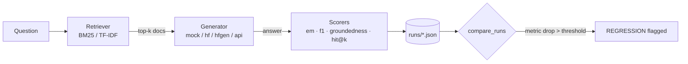

# rag-eval

**An offline-first evaluation harness that catches RAG regressions before they ship.**

How do you know a change to a retrieval-augmented QA system didn't quietly start
hallucinating, or retrieving the wrong passages? `rag-eval` runs a real
BM25/TF-IDF retriever and a pluggable generator over a 235-passage SQuAD v2
corpus, scores every answer, saves each run, and automatically flags any metric
that regresses between runs.

It runs **fully offline on first clone** — committed SQuAD v2 data plus a
deterministic generator mean `pytest` and the demo work with no network, no API
key, and no GPU.

---

## Headline result

Shrinking retrieved context from `k=5` to `k=1` (same BM25 retriever, only `k`
changes) on a 50-question SQuAD v2 set, using a local extractive model
(`distilbert-base-cased-distilled-squad`) on CPU:

| metric | k=5 | k=1 | delta | flagged |
|---|---|---|---|---|
| `retrieval_hit` | 0.880 | 0.720 | **-0.160** | REGRESSION |
| `f1` | 0.623 | 0.553 | -0.070 | REGRESSION |
| `em` | 0.520 | 0.500 | -0.020 | REGRESSION |
| `groundedness` | 1.000 | 1.000 | +0.000 | |

Retrieval hit-rate moves most because it directly measures whether the gold
paragraph survived the smaller `k`; `f1`/`em` follow as the reader extracts from
the wrong passage. The harness detects all three drops with no manual inspection.

**Swap only the generator** and a *different* failure mode appears. Re-running the
same `k=5` BM25 retrieval with a small generative model
(`Qwen/Qwen2.5-0.5B-Instruct`) instead of the extractive reader:

| metric | extractive | generative | delta | flagged |
|---|---|---|---|---|
| `groundedness` | 1.000 | 0.924 | **-0.076** | REGRESSION |
| `f1` | 0.623 | 0.571 | -0.052 | REGRESSION |
| `em` | 0.520 | 0.480 | -0.040 | REGRESSION |
| `retrieval_hit` | 0.880 | 0.880 | +0.000 | |

Retrieval is identical, so the groundedness drop is *purely the generator*
paraphrasing or answering from parametric memory instead of the retrieved
context — exactly the hallucination signal the harness exists to catch.

Full write-up with the TF-IDF comparison and reproduction steps:
[`docs/RESULTS.md`](docs/RESULTS.md).

---

## What this project demonstrates

- **RAG quality infrastructure**, not just a RAG app — retrieval hit@k,
  groundedness/hallucination detection, and automated regression gating.
- **Clean architecture**: the evaluator (`rag_eval`) talks only to
  `Retriever`/`Generator` protocols and never imports the system under test
  (`example_rag`), so any RAG system plugs in without touching the harness.
- **Evaluation literacy**: knowing *why* retrieval needs its own metric separate
  from answer quality, why determinism beats peak scores for a regression
  harness, and what a lexical groundedness heuristic can and can't catch.
- **Production sensibilities**: offline-first for CI, reproducible byte-identical
  runs, friendly errors, typed code, and a tested public surface.
- **Practical ML range**: a from-scratch TF-IDF retriever, BM25, a local
  HuggingFace extractive reader, a local generative model, and an
  OpenAI-compatible client — all behind one interface.

---

## How it works



The repository is split into two packages so the evaluator and the thing being
evaluated stay independent:

- **`src/rag_eval/`** — the reusable **harness**: the `Retriever`/`Generator`
  protocols, the `RAGPipeline` glue, the scorers, the runner, and run
  comparison. Delete `example_rag` and the harness still stands alone.
- **`src/example_rag/`** — one concrete, swappable **system under test**:
  BM25/TF-IDF retrievers, four generator tiers, and the CLI that wires them to
  the SQuAD v2 benchmark.

The benchmark is a real search problem: SQuAD v2 paragraphs are pooled into a
single ~235-doc corpus where each question's source paragraph is its
`gold_doc_id` and every other paragraph is a distractor.

### Scorers

| metric | what it measures |
|---|---|
| `em` / `f1` | answer correctness vs reference (SQuAD-style normalization) |
| `groundedness` | fraction of answer tokens supported by retrieved docs (hallucination tripwire) |
| `retrieval_hit` | true hit@k — did the gold paragraph make the top-k? |

All metrics are normalized to `[0.0, 1.0]` so aggregation and run-to-run deltas
stay uniform.

---

## Quickstart

```bash
uv sync --dev
uv run python -m example_rag demo   # k=5 vs k=1, prints the headline table
uv run pytest -q                     # 14 tests, fully offline
```

Windows PowerShell is identical; for plain `pip`, see the commands below.

<details>
<summary>pip / venv setup</summary>

```bash
python -m venv .venv
source .venv/bin/activate          # PowerShell: .\.venv\Scripts\Activate.ps1
pip install -r requirements.txt
pip install -e .
```
</details>

Common commands:

```bash
uv run python -m example_rag run --k 5 --retriever bm25      # one eval, saved to runs/
uv run python -m example_rag run --generator hf              # local extractive model (CPU)
uv run python -m example_rag run --retriever tfidf           # swap the retriever
uv run python -m example_rag compare                         # compare the two latest runs
```

On first `run`, it tries to download `validation[:2000]` from HuggingFace
`rajpurkar/squad_v2` and caches it locally; if offline, it falls back to the
committed `data/squad_sample.jsonl` + `data/squad_corpus.jsonl`.

For a visual tour with flowcharts, open
[`docs/repo_overview.html`](docs/repo_overview.html) in a browser.

---

## Generator tiers

One flag (`--generator`) switches between them; all see retrieved docs only:

| tier | what it is | setup |
|---|---|---|
| `mock` (default) | deterministic span extractor | none — offline, no key |
| `hf` | local HuggingFace extractive QA on CPU | first-run model download |
| `hfgen` | local HuggingFace generative LM on CPU | first-run model download |
| `local` | LM Studio's OpenAI-compatible server | load a model in LM Studio |
| `api` | any hosted OpenAI-compatible endpoint | `OPENAI_API_KEY` |

---

## Design choices & honest limitations

- **Determinism is a feature.** The default mock generator is no-ML, so absolute
  `em`/`f1` are modest by design — but every run is byte-identical, so a metric
  delta is unambiguously attributable to the change under test, not sampling
  noise. Swap in `hf`/`hfgen`/`api` for higher absolute correctness.
- **Groundedness is lexical, not semantic** — it catches abstention and
  fabrication, not whether the *right* passage was used (that's `retrieval_hit`).
  `LLMJudgeScorer` is stubbed as the seam where a semantic judge plugs in.
- **One small corpus, one test set.** 235 paragraphs from a 2000-row slice; a
  larger, more diverse slice would be a harder retrieval test.

### Next steps

Implement `LLMJudgeScorer` for semantic faithfulness, pool a larger SQuAD slice,
and wire `compare` into CI to fail a PR when any aggregate regresses past
threshold.

---

## Extending it to your own system

The harness stays untouched — implement the two protocols in your own package:

```python
class MyRetriever:
    def retrieve(self, question: str, corpus: list[Doc], k: int) -> list[Doc]: ...

class MyGenerator:
    def generate(self, question: str, docs: list[Doc]) -> str: ...
```

Hand them to `RAGPipeline` and run them through the same `run_eval` / `compare_runs`
flow. Add new metrics in `src/rag_eval/scorers.py`, keeping each normalized to
`[0.0, 1.0]`. `example_rag/retrievers.py` ships an `EmbeddingRetriever` stub to
start from for vector search.
